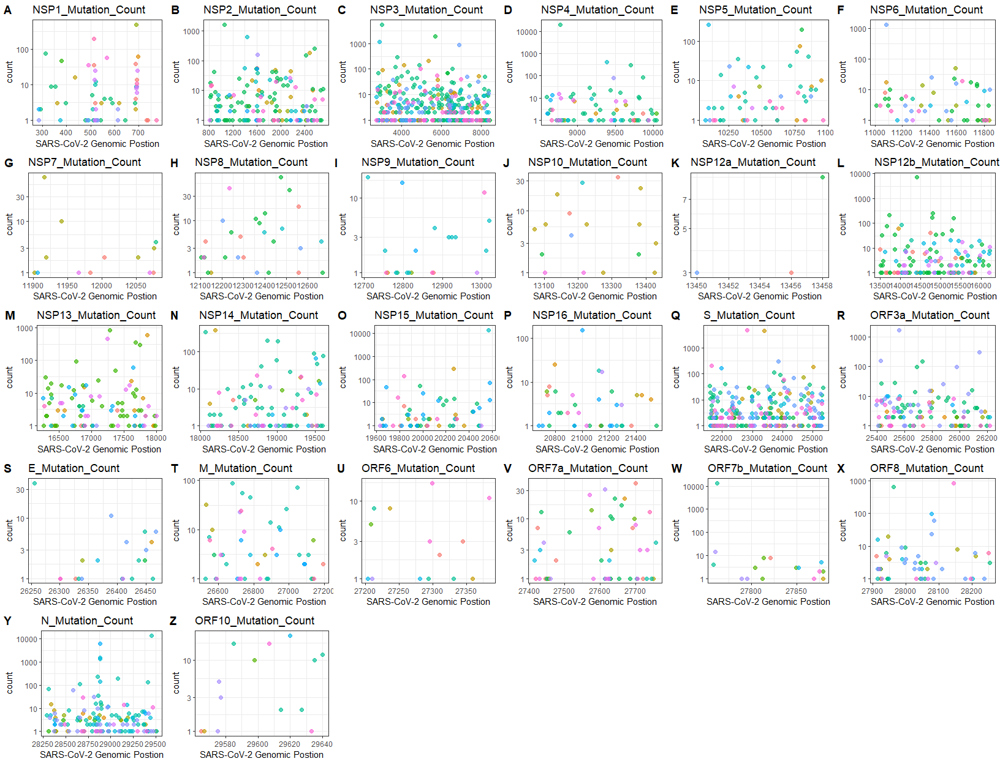

<!-- README.md is generated from README.Rmd. Please edit that file -->

# CovidMutations
A feasible framework for annotation and mutation analysis of COVID-19, including mutation profile visualization, statistics and the country distribution of mutational events. The assay data is conducive to detecting mutations in the SARS-CoV-2 genome.

<!-- badges: start -->

<!-- badges: end -->

### Installation

``` r
devtools::install_github("MSQ-123/CovidMutations")
```

### Usage

#### mergeEvents

Merge neighboring events of SNP, insertion and deletion.

``` r
#The example data:
data("nucmer")

#The input nucmer object can be made by the comment below:
#options(stringsAsFactors = FALSE)
#nucmer<-read.delim("nucmer.snps",as.is=TRUE,skip=4,header=FALSE)
#colnames(nucmer)<-c("rpos","rvar","qvar","qpos","","","","","rlength","qlength","","","rname","qname")
#rownames(nucmer)<-paste0("var",1:nrow(nucmer))

# Fix IUPAC codes
nucmer<-nucmer[!nucmer$qvar%in%c("B","D","H","K","M","N","R","S","V","W","Y"),]
nucmer<- mergeEvents(nucmer = nucmer)## This will update the nucmer object
```

#### indelSNP

Provide effects of each SNP, insertion and deletion in virus genome.

``` r
data("refseq")
data("gff3")
annot <- setNames(gff3[,10],gff3[,9])  #annot: subset the gene and its product.
outdir <- tempdir()
indelSNP(nucmer = nucmer,
         saveRda = FALSE,
         refseq = refseq,
         gff3 = gff3,
         annot = annot,
         outdir = outdir)
```

#### plotMutAnno

Plot the mutation statistics after annotating the “nucmer” object by
“indelSNP” function.

``` r
data("covid_annot")
covid_annot <- as.data.frame(covid_annot)
#outdir <- tempdir()
plotMutAnno(results = covid_annot,figureType = "MostMut", outdir = outdir)
```

#### nucmerRMD

Preprocess “nucmer” object to add group information.

``` r
data("nucmer")
data("chinalist")
outdir <- tempdir()
nucmerRMD(nucmer = nucmer, outdir = outdir, chinalist = chinalist)
```

#### globalSNPprofile

Global SNP profiling in virus genome

Note: In order to get a better global SNP profile, the “nucmerr” data is
obtained from 150000 mutation sites downsampled from the “nucmer”
object(which is for 37527 samples, not for 5465 samples in the “nucmer”
example data).

``` r
data("nucmerr")
outdir <- tempdir()
globalSNPprofile(nucmerr = nucmerr, outdir = outdir, figure_Type = "heatmap")
```

#### mutStat

Plot mutation statistics for nucleiotide.

If the figure type is “TopCountryMut”, “mutpos” can specify a range of
genomic position(eg. 28831:28931) for plot.

``` r
outdir <- tempdir()
mutStat(nucmerr = nucmerr,
        outdir = ".",
        figure_Type = "TopMuSample",
        type_top = 10,
        country = FALSE,
        mutpos = NULL)
```

#### AssayMutRatio

Calculate the mutation detection rate using different assays

``` r
data("assays")
Total <- 11000 ## Total Cleared GISAID fasta data, sekitseq
outdir <- tempdir()
#Output the results
AssayMutRatio(nucmerr = nucmerr,
              assays = assays,
              totalsample = Total,
              plotType = "logtrans",
              outdir = outdir)
```

#### MutByGene

Plot mutation counts for certain genes

``` r
data("gene_position")
outdir <- tempdir()
MutByGene(nucmerr = nucmerr, gff3 = gene_position, figurelist = TRUE, outdir = outdir)
```



``` r
#if figurelist = TRUE, the recommendation for figure display(in pixel)is: width=1650, height=1300
```
=======


