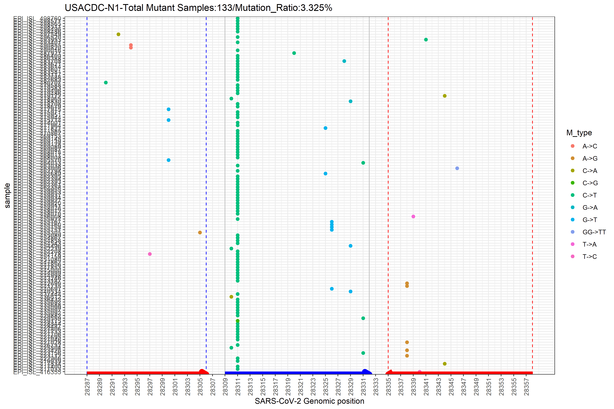

<p>
**R version**: `r R.version.string`
<br />
**Package version**: `r packageVersion("CovidMutations")`
</p>


```{r setup, include=FALSE}
#set knitr chunk options
knitr::opts_chunk$set(warning = FALSE, message = FALSE)

#load packages to avoid startup messages later in the code
suppressPackageStartupMessages({library(CovidMutations)})
library(ggplot2)
library(cowplot)
library(seqinr)
library(stringr)
library(grDevices)
library(graphics)
library(utils)
library(ggpubr)
library(dplyr)
library(VennDiagram)
```

```{r, include = FALSE}
knitr::opts_chunk$set(
  collapse = TRUE,
  comment = "#>",
  echo = TRUE, warning=FALSE, message=FALSE
)
```


# Introduction

  The novel respiratory disease COVID-19 has caused worldwide pandemic and large efforts are currently being undertaken in characterizing the virus (SARS-CoV-2) causing it in both molecular and epidemiological aspects[@Dong.2020]. The genomic variability of SARS-CoV-2 may largely correlate with the virus specific etiological effects[@Kim.2020]. In the present study, by detailing the characteristics of SARS-CoV-2 complete genomes currently available on the Global Initiative on Sharing Avian Influenza Data (GISAID) consortium[@Elbe.2017], We analyze and annotate all SARS-CoV-2 mutations compared with the reference Wuhan genome NC_045512.2. Our analysis shows the mutational pattern of different type of mutations and may reveal their potential effects on proteins. Reverse transcription polymerase chain reaction (RT-PCR) was the first method developed for COVID-19 detection and is the current gold standard as it offers both high accuracy and throughput[@Corman.2020]. it is increasingly critical to evaluate the performance of RT-PCR tests using both experimental tests and in-silico analysis. Here we present a feasible method to evaluate the detection efficiency of different real-time reverse-transcription polymerase chain reaction (RT-PCR) assays available as example data[@SanchezPadilla.2015]. By tracking mutational trends in viral sequences and evaluating the effectiveness of assay (mutation ratio in detecting regions), we provide options for further design of highly sensitive, clinically useful assays. Our analysis may provide new strategies of antiviral therapy based on the molecular characteristics of this novel virus[@Mercatelli.2020].

# Downloading and preparing the data


The `fasta` file of SARS-CoV-2 genome is made available through the [GISAID](https://www.gisaid.org/). Users have to log in to access the data. In the Browse session, the hCoV-19 can be downloaded following the instructions below:

Then click the `Download` button to download all available `fasta` files. The `fasta` file is processed by `seqkit` software[@Shen.2016] and `Nucmer` script[@Delcher.2002] under linux to produce the `nucmer.snps` file, the procedure is:

```{r preprocess, eval=FALSE}
#  download the SARS-Cov-2 genomics sequence(*.fasta) from Gisaid website( comploe, high coverage only, low coverage exclusion, Host=human, Virus name=hCoV-19)
# download NC_045512.2.fa from NCBI as reference for alignment

#specify your fasta file as input
input=gisaid_hcov-19_2020_06_14_04.fasta


#Command line
## clear the data
seqkit grep  -s -p - $input -v > Gisaid_clear.fasta  # remove the data with '-'

## Run nucmer to obtain variant file

ref=NC_045512.2.fa # The reference SARS-CoV-2 Wuhan Genome

## Covert the DOS/window file format to UNIX format for both ref and input files

sed 's/^M$//' Gisaid_clear.fasta > Gisaid_clear_format.fasta
sed 's/^M$//' NC_045512.2.fa > ref.fa


## remove fasta sequence with duplicated ID 
awk '/^>/{f=!d[$1];d[$1]=1}f' Gisaid_clear_format.fasta > Gisaid_RMD.fasta
## calculate total sample(important for analysis)
grep -c '^>' Gisaid_RMD.fasta
## downsampling fasta seq:
seqkit sample --proportion 0.15 Gisaid_RMD.fasta > Gisaid_RMD_15.fasta


### Snap-calling
nucmer --forward -p nucmer ref.fa Gisaid_RMD.fasta
show-coords -r -c -l nucmer.delta > nucmer.coords
show-snps nucmer.delta -T -l > nucmer.snps

#Command line(single step)
# seqkit grep  -s -p - $input -v |sed 's/^M$//' |awk '/^>/{f=!d[$1];d[$1]=1}f' >Gisaid_RMD.fasta
```


followed by read into R:

```{r read_nucmer, eval=FALSE}
nucmer<- read.delim('nucmer.snps',as.is=TRUE,skip=4,header=FALSE)
```

Than the downstream analysis can be performed by manipulating the `nucmer` object.

In summary, the following steps need to be performed to prepare the data:

1. Create an account for GISAID login
2. Filter and download the fasta file
3. Preprocess the `fasta` file with linux command line
4. Read the preprocessed data into R


# Annotate the mutational events

## Merge neighboring events of SNP, insertion and deletion

The first step for handling the `nucmer` object is to preprocess it by defining each column name and merging different types of mutations (single nucleotide polymorphism (SNP), insertion and deletion etc.), then the undated `nucmer` object could be annotated.   


To best display the procedure, we provide example data: 
```{r load_nucmer, echo=TRUE, message=FALSE, warning=FALSE}
library(CovidMutations)
#The example data:
data("nucmer")
```

Another way to implement the procedure is to read in the raw data (nucmer.snps) provided as extdata: 

```{r read_raw, echo=TRUE, message=FALSE, warning=FALSE}
nucmer<- read.delim(unzip(system.file(package="CovidMutations", "extdata", "nucmer10.zip")), as.is = T, skip = 4, header = F)
```

Users can also download their coronavirus data to build the `nucmer` object as mentioned previously, once the `nucmer.snps` file is generated, the input `nucmer` object can be made by following steps:

```{r prepro_nucmer, eval=TRUE, echo=TRUE, message=FALSE, warning=FALSE}
options(stringsAsFactors = FALSE)
#read in R:
#nucmer<-read.delim("nucmer.snps",as.is=TRUE,skip=4,header=FALSE)
colnames(nucmer)<-c("rpos","rvar","qvar","qpos","","","","","rlength","qlength","","","rname","qname")
rownames(nucmer)<-paste0("var",1:nrow(nucmer))
```

After building `nucmer` object, it should be filtered to exclude unwanted symbols:

```{r mergeEvents, echo=TRUE, message=FALSE, warning=FALSE, paged.print=FALSE}

# Fix IUPAC codes, both the example data and data created by users should perform the steps below:
nucmer<-nucmer[!nucmer$qvar%in%c("B","D","H","K","M","N","R","S","V","W","Y"),]
nucmer<- mergeEvents(nucmer = nucmer)## This will update the nucmer object
head(nucmer)
```

## Provide effects of each SNP, insertion and deletion

The updated `nucmer` object is used as input for annotating the mutations, the refseq data and gff3 data are downloaded from ncbi database[@Wu.2020]. The `indelSNP()` function returns the result of annotation as `.csv` file, or `.rda` file (saveRda = TRUE).

```{r indelSNP, echo=TRUE, message=FALSE, warning=FALSE, paged.print=FALSE}
data("refseq")
data("gff3")
annot <- setNames(gff3[,10],gff3[,9])  #annot: subset the gene and its product from gff3 file
outdir <- tempdir()
covid_annot<- indelSNP(nucmer = nucmer,
         saveRda = FALSE,
         refseq = refseq,
         gff3 = gff3,
         annot = annot,
         outdir = outdir)
```


# Mutation statistics and profile

## Basic descriptions for the mutational events.
Plot the mutation statistics after annotating the `nucmer` object by `indelSNP` function. The example data `covid_annot` is downsampled annotation data generated by `indelSNP` function. 

The updated `numcer` object (`covid_annot`) includes annotations for each mutation:

```{r nucmer-anno, echo=TRUE, message=FALSE, warning=FALSE}
#data("covid_annot") We provide example covid_annot results produced by the `indelSNP` function
covid_annot <- as.data.frame(covid_annot)
head(covid_annot)

```

If the `outdir` is NULL, the plot shows in the R studio panel.  

```{r mostmut, fig.cap = "Barplot of mutation counts for the downsampled data. The sample ID shown below the x axis.", echo=TRUE, message=FALSE, warning=FALSE, paged.print=FALSE}

plotMutAnno(results = covid_annot,figureType = "MostMut", outdir = NULL)
```

Other types of figures available are shown below:

Average mutation counts for each sample:
```{r MutPerSample, fig.cap = "Barplot of average mutation counts for the downsampled data", echo=TRUE, message=FALSE, warning=FALSE, paged.print=FALSE}
plotMutAnno(results = covid_annot,figureType = "MutPerSample", outdir = NULL)

```


Most frequent events per class:
```{r VarClasses, fig.cap = "Barplot of most frequent mutational events for the downsampled data", echo=TRUE, message=FALSE, warning=FALSE, paged.print=FALSE}
plotMutAnno(results = covid_annot,figureType = "VarClasses", outdir = NULL)

```

Most frequent mutational type:
```{r VarType, fig.cap = "Barplot of most frequent mutational type for the downsampled data", echo=TRUE, message=FALSE, warning=FALSE, paged.print=FALSE}
plotMutAnno(results = covid_annot,figureType = "VarType", outdir = NULL)

```


Most frequent events (nucleotide):
```{r NucleoEvents, fig.cap = "Barplot of most frequent events (nucleotide) for the downsampled data", echo=TRUE, message=FALSE, warning=FALSE, paged.print=FALSE}
plotMutAnno(results = covid_annot,figureType = "NucleoEvents", outdir = NULL)

```


Most frequent events (proteins):
```{r ProEvents, fig.cap = "Barplot of most frequent events (proteins) for the downsampled data", echo=TRUE, message=FALSE, warning=FALSE, paged.print=FALSE}
plotMutAnno(results = covid_annot,figureType = "ProEvents", outdir = NULL)

```


## The most frequent mutational events for each protein 

Identifying mutational profile for selected protein is critical for understanding virus evolution and targeted therapy[@Taiaroa.2020], also, hypothesizing targetable targets for drug design[@SanchezPadilla.2015]. The `plotMutProteins` function is for displaying representative mutational events in the coding proteins that relevant to virus infection. The `proteinName` parameter is specified for SARS-CoV-2 genome. See available choices by `?plotMutProteins`. Change the `top` parameter to choose numbers of observations.

```{r plotMutProteins, fig.cap = "Barplot of most mutated variant for each protein", echo=TRUE, message=FALSE, warning=FALSE, paged.print=FALSE}
#data("covid_annot")
covid_annot <- as.data.frame(covid_annot)
plotMutProteins(results = covid_annot,proteinName = "NSP2", top = 20, outdir = NULL)
```


## Preprocess nucmer object to add group information

To assess the geographical distribution of virus strain and provide global profile of SNPs, nucmer is processed to add additional group information and update the column name, the `chinalist` data is for replacing cities in China into "China" to make the distribution analysis easier. The function `nucmerRMD` returns an updated `nucmer` object (to distinguish it from nucmer, this updated `nucmer` object is called `nucmerr` in the following session). 
.
```{r nucmerRMD, echo=TRUE, message=FALSE, warning=FALSE, paged.print=FALSE}
#data("nucmer")
data("chinalist")
#outdir <- tempdir()
nucmerr<- nucmerRMD(nucmer = nucmer, outdir = NULL, chinalist = chinalist)
head(nucmerr)
```

For analyzing virus data other than SARS-CoV-2, users can also make their own `nucmerr` object, following code below:

```{r nucmerrDIY1, echo=TRUE, message=FALSE, warning=FALSE, paged.print=FALSE}
#make sure that the nucmer object has the right column name: "rpos","rvar","qvar","qpos","ID"
nucmer <- nucmer[,c(1,2,3,4,14)]
colnames(nucmer)<-c("rpos","rvar","qvar","qpos","ID")
```

Add sample, time, country group columns: please make sure that the `nucmer` ID comprises necessary group information in format like:
```{r ID, eval=FALSE}
hCoV-19/France/B5322/2020|EPI_ISL_443266|2020-03-16
```

Extract simplified ID (EPI_ISL_443266), time (2020-03-16) and country (France) from `nucmer` ID and add mutation types:
```{r nucmerrDIY2, echo=TRUE, message=FALSE, warning=FALSE, paged.print=FALSE}
nucmer$sample <-vapply(strsplit(as.character(nucmer$ID), "[|]"), function(x) x[2], character(1))
nucmer$time <-vapply(strsplit(as.character(nucmer$ID), "[|]"), function(x) x[3], character(1))
nucmer$country <-vapply(strsplit(as.character(nucmer$ID), "[/]"), function(x) x[2], character(1))

#M_type represents mutation type, PM_type represents positions and mutation type.  
nucmer$M_type <-str_c(nucmer$rvar,nucmer$qvar,sep ="->")
nucmer$PM_type <-str_c(nucmer$rpos,nucmer$M_type,sep =":")
```

The updated nucmer is nucmerr now, check the format:
```{r, nucmerrCheck, echo=TRUE, message=FALSE, warning=FALSE, paged.print=FALSE}
nucmerr <- nucmer
head(nucmerr)
```


## Global SNP profiling in virus genome

The mutational profile (global SNPs) is visualized by function `globalSNPprofile`, so that the typical mutational pattern for samples data in the nucmerr object is presented. The `nucmerr` example data is downsampled data, preprocessed by `nucmerRMD` function. Specify the `figure_Type` parameter to display either heatmap or count plot.

```{r globalSNPprofile, fig.cap = "Global SNPs pattern across the genome", echo=TRUE, message=FALSE, warning=FALSE, paged.print=FALSE}
#data("nucmerr") We provide example nucmerr object produced by the `nucmerRMD` function
head(nucmerr)
#outdir <- tempdir()
globalSNPprofile(nucmerr = nucmerr, outdir = NULL, figure_Type = "heatmap", country = "global", top = 5)
```

The `country` parameter is for choosing a country area to plot local mutational profile ("USA", "india", "China", "England". etc.). If `country` = `global`, the output is for mutations across all countries.

```{r USASNPprofile, fig.cap = "Local SNPs pattern across the genome (for USA)", echo=TRUE, message=FALSE, warning=FALSE, paged.print=FALSE}
globalSNPprofile(nucmerr = nucmerr, outdir = NULL, figure_Type = "heatmap", country = "USA", top = 5)
```

Now we can compare the "USA" pattern with the "England" pattern:

```{r EngSNPprofile, fig.cap = "Local SNPs pattern across the genome (for England)", echo=TRUE, message=FALSE, warning=FALSE, paged.print=FALSE}
globalSNPprofile(nucmerr = nucmerr, outdir = NULL, figure_Type = "heatmap", country = "England", top = 5)
```

The country list:

```{r countrylist, eval=FALSE}
 [1] "Algeria"     "Argentina"   "Australia"   "Austria"     "Bahrein"    
 [6] "Bangladesh"  "bat"         "Belgium"     "Benin"       "Brazil"     
[11] "Brunei"      "Bulgaria"    "Canada"      "Chile"       "China"      
[16] "Colombia"    "Croatia"     "Cyprus"      "Denmark"     "DRC"        
[21] "Ecuador"     "Egypt"       "England"     "env"         "Estonia"    
[26] "Felis"       "Finland"     "France"      "Gambia"      "Georgia"    
[31] "Germany"     "Greece"      "Hungary"     "Iceland"     "india"      
[36] "India"       "Indonesia"   "Iran"        "Ireland"     "Israel"     
[41] "Italy"       "ITALY"       "Jamaica"     "Japan"       "Jordan"     
[46] "Kazakhstan"  "Kenya"       "Korea"       "Latvia"      "Lebanon"    
[51] "Luxembourg"  "Malaysia"    "Mexico"      "mink"        "Mongolia"   
[56] "Morocco"     "Netherlands" "New"         "Nigeria"     "Norway"     
[61] "Oman"        "Pakistan"    "pangolin"    "Poland"      "Portugal"   
[66] "Puerto"      "Romania"     "Russia"      "Scotland"    "Senegal"    
[71] "Serbia"      "Shaoxing"    "Singapore"   "Slovakia"    "South"      
[76] "SouthAfrica" "Spain"       "Sweden"      "Switzerland" "Taiwan"     
[81] "Thailand"    "Tunisia"     "Turkey"      "Uganda"      "United"     
[86] "Uruguay"     "USA"         "Venezuela"   "Vietnam"     "Wales"      
[91] "Yichun"  
```

## Global protein mutational events profiling

To better guide the production of molecule-targeted drugs, further analyzing the global profile of protein mutations is needed. The heatmap below shows some significant pattern of SARS-CoV-2 mutational effects in several regions. The 'top' parameter is for specifying the number of observations to display in the final figure:

```{r globalProteinMut, fig.cap = "Global protein mutational pattern across the genome", echo=TRUE, message=FALSE, warning=FALSE, paged.print=FALSE}
globalProteinMut(covid_annot = covid_annot, outdir = NULL, figure_Type = "heatmap", top = 10, country = "global")
```

The count plot is available by adjusting the `figure_Type` parameter:

```{r globalProteinMut-count, fig.cap = "Global protein mutational counts across the genome", echo=TRUE, message=FALSE, warning=FALSE, paged.print=FALSE}
globalProteinMut(covid_annot = covid_annot, outdir = NULL, figure_Type = "count", top = 10, country = "global")
```

Like `globalSNPprofile` function, the `country` parameter is also available:

```{r globalProteinMut-USA, fig.cap = "Local protein mutational pattern across the genome (for USA)", echo=TRUE, message=FALSE, warning=FALSE, paged.print=FALSE}
globalProteinMut(covid_annot = covid_annot, outdir = NULL, figure_Type = "heatmap", top = 10, country = "USA")
```

We can compare the patterns between two countries: 
```{r globalProteinMut-England, fig.cap = "Local protein mutational pattern across the genome (for England)", echo=TRUE, message=FALSE, warning=FALSE, paged.print=FALSE}
globalProteinMut(covid_annot = covid_annot, outdir = NULL, figure_Type = "heatmap", top = 10, country = "England")
```

## Plot mutation distribution and mutation statistics

Visualization for the top mutated samples, average mutational counts, top mutated position in the genome, mutational density across the genome and distribution of mutations across countries. Try `?mutStat` to see available options for the `figure_Type` parameter.


```{r mutStat, fig.cap = "Top 10 mutated samples", echo=TRUE, message=FALSE, warning=FALSE, paged.print=FALSE}
#outdir <- tempdir()
mutStat(nucmerr = nucmerr,
        outdir = NULL,
        figure_Type = "TopMuSample",
        type_top = 10,
        country = FALSE,
        mutpos = NULL)

```

If the figure type is "TopCountryMut", `mutpos` can specify a range of genomic position (e.g. 28831:28931) for density plot.

```{r TopCountryMut, fig.cap = "Mutational density across the genome in different countries", echo=TRUE, message=FALSE, warning=FALSE, paged.print=FALSE}
#outdir <- tempdir()
mutStat(nucmerr = nucmerr,
        outdir = NULL,
        figure_Type = "TopCountryMut",
        type_top = 10,
        country = TRUE,  #involve country distribution, country =TRUE
        mutpos = 28831:28931)

```


The "MutDens" `figure_Type` is for mutational density profiling by position:
```{r MutDens, fig.cap = "Global mutational density profiling", echo=TRUE, message=FALSE, warning=FALSE, paged.print=FALSE}
#outdir <- tempdir()
mutStat(nucmerr = nucmerr,
        outdir = NULL,
        figure_Type = "MutDens",
        type_top = NULL, 
        country = FALSE,  
        mutpos = NULL)

```

## Plot mutation counts for certain genes

Genes responsible for virus infection or transmission may have higher mutation counts. So we plot mutation counts for each gene to identify the gene most susceptible to mutation.

The "gene_position" file is derived from gff3 file. If `figurelist` = FALSE, mutation counts for each gene is saved as figure file.

```{r MutByGene, fig.cap = "Mutation counts for each gene", echo=TRUE, fig.height=8, fig.width=10, message=FALSE, warning=FALSE, paged.print=FALSE}
data("gene_position")
#outdir <- tempdir()
MutByGene(nucmerr = nucmerr, gff3 = gene_position, figurelist = TRUE, outdir = NULL)
#if figurelist = TRUE, the recommendation for figure display(in pixel)is: width=1650, height=1300
```


# Assays efficiency

The detection of SARS-CoV-2 is important for the prevention of the outbreak and management of patients. RT-PCR assay is one of the most effective molecular diagnosis strategies to detect virus in clinical laboratory[@Kilic.2020].

## Calculate the mutation ratio using different assays

The `assays` example data contains some current assays for detecting  SARS-CoV-2 genome for different regions, like ORF-1ab, N protein, etc. The "F1", "F2", "R1", "R2" refer to genomic positions of two pairs of primers (forward primer and reverse primer). The "P1","P2" refer to genomic positions of probes for detection. As SARS-CoV-2 genome is still evolving over time, we assume that assays for detecting this pathogen should also be changed and optimized given that assays detecting high-mutation-ratio region may lead to more false negatives, which may cause severe results. Users can design their own assay and transform the assays information according to the format shown by the example data to evaluate whether their assays are efficient for detecting potential SARS-CoV-2.

```{r assays, echo=TRUE, message=FALSE, warning=FALSE}
data("assays")
assays
```

The function `AssayMutRatio` is to use the well established RT-PCR assays information to detect mutation ratio in different SARS-CoV-2 genomic sites. The output will be series of figures presenting the mutation profile using a specific assay (output as file, the arrows show the directions of primers (red) and probes (blue). F1, R2, P1 for 5', F2, R1, P2 for 3') and a figure for comparison between the mutation ratio by each assay (if `outdir` is NULL, it returns only the figure for comparison). To some extent we believe that the lower the mutation ratio, the higher the reliability of RT-PCR.

```{r AssayMutRatio, fig.cap = "Mutation detection rate using different assays", echo=TRUE, message=FALSE, warning=FALSE, paged.print=FALSE}
Total <- 4000 ## Total Cleared GISAID fasta data, sekitseq
#outdir <- tempdir()
#Output the results
AssayMutRatio(nucmerr = nucmerr,
              assays = assays,
              totalsample = Total,
              plotType = "logtrans",
              outdir = NULL)

```

If `outdir` is specified, one of the output figure of assays is like:



## Bacth assay analysis for last five Nr of primers

Last five nucleotides of primer mutation count/type for any RT-PCR primer. This is also an evaluation aspect for assays efficiency.

The `LastfiveNrMutation` function returns mutation counts(last five nucleotides for each primer) for each assay as output. If the `figurelist` = FALSE, it outputs each assay detecting profile as image file separately.

```{r LastfiveNrMutation, fig.cap = "Mutation detection counts (last five nucleotides for each primer) using different assays", echo=TRUE, message=FALSE, warning=FALSE, paged.print=FALSE, fig.height=8, fig.width=10}
totalsample <- 4000

LastfiveNrMutation(nucmerr = nucmerr,
                    assays = assays,
                    totalsample = totalsample,
                    figurelist = TRUE,
                    outdir = NULL)

```

e.g., the last five nucleotides mutation pattern of primers of ChinaCDC-N:


## Detection of co-occurring mutations using double-assay

Moreover, researchers may have a question about the performance of double assays in detecting samples with co-occurring mutations (significant mutational pattern), as some mutations are definitely co-occurring more frequently. Further, specificity of a test is enhanced by targeting multiple loci[@Kilic.2020]. Here we designed a function for simultaneously measuring the mutated samples using two different assays. The information of first assay and second assay should be  structured like the example assays data, containing F1, F2, R1, R2, P1, P2 sites.  

Users can use their personalized assay data to implement the code below. 

```{r doubleAssay, fig.cap = "Mutation detection counts (last five nucleotides for each primer) using double assays. The samples shown on the y-axis for both assays are co-occurring mutated samples. Because the downsampled example data is too small, here we also display the actual results using real data shown below", echo=TRUE, message=FALSE, warning=FALSE, paged.print=FALSE, fig.height=6, fig.width=10}
assay1 <- assays[1,]
assay2 <- assays[2,]
doubleAssay(nucmerr = nucmerr,
            assay1 = assay1,
            assay2 = assay2,
            outdir = NULL)

```


The `co_Mutation_Ratio` is calculated by dividing the number of samples with co-occurring mutations by the total mutated samples detected using each assay.

The co-occurring mutated samples are shown as the overlap in the "venn" diagram. The `doubleAssay` function returns the information of these samples as `.csv` file by giving the `outdir` parameter. 

We believe that the lower the `co_Mutation_Ratio` , the more efficient the detection.


# Packages used

This workflow depends on R version 3.6.2 (2019-12-12) or higher. The complete list of the packages used for this workflow are shown below:

```{r session_info}
sessionInfo()
```

References {.unnumbered}
==========
